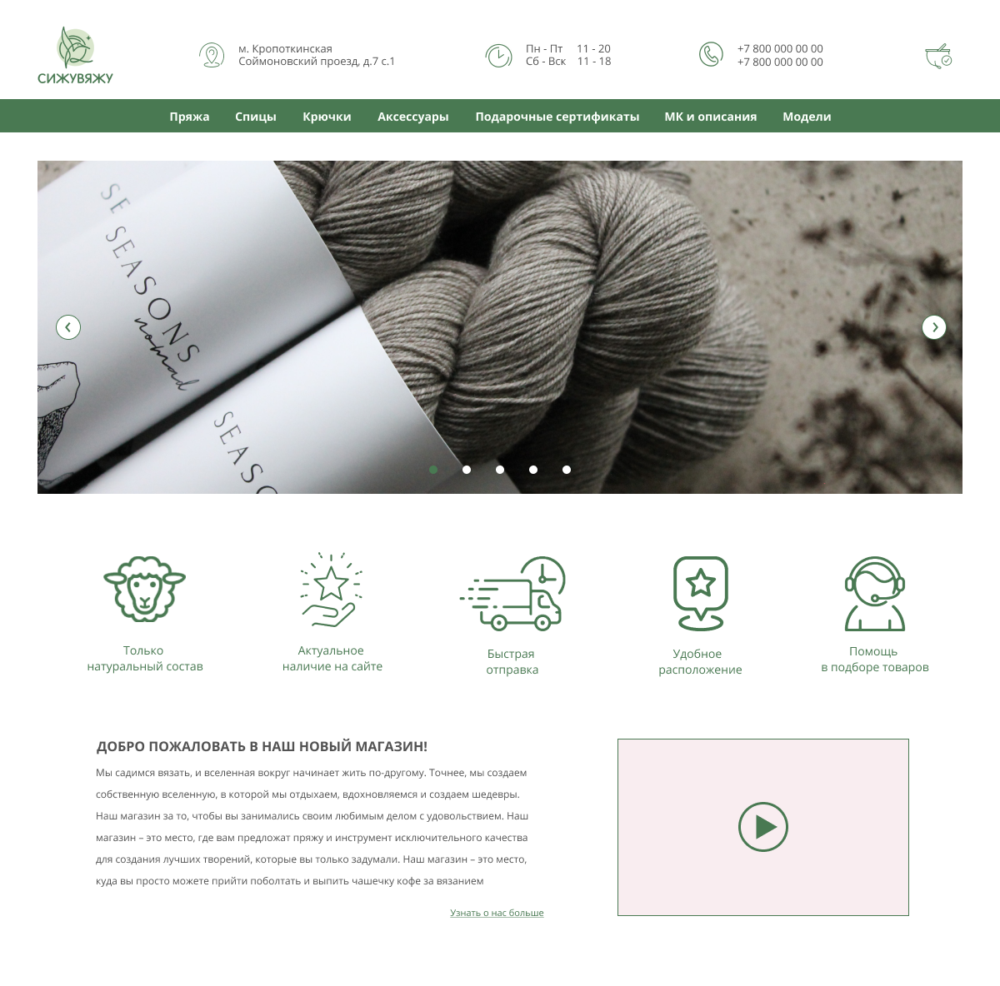

# Тестовое задание на позицию веб-разработчика от компании "Ecwid"

Задача:
1. Сверстать макет страницы - кроссбраузерно, респонсивно.

   

   Макет представлен только в одном разрешении, однако стоит его адаптировать под экраны 
   мобильных устройств и планшетов.
   
2. Оживить слайдер с картинками на макете, сделав перелистывание картинок на JS.

В именовании CSS классов необходимо использовать BEM. Классы и JS-переменные должны иметь 
говорящие названия.

Использовать готовые библиотеки и решения нельзя, так как цель данного задания - 
показать свои навыки верстки и программирования.

Требования к заданию:
- поддержка браузеров: две последние мажорные версии (FF, Chrome, IE);
- поддержка mobile/desktop устройств;
- использование соглашения по именованию BEM;
- предпочтительно использование CSS-препроцессоров.